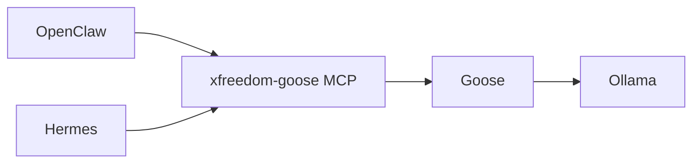

# XFreedom AI Agent Stack

Production-oriented bootstrap for OpenClaw, Hermes Agent, and a shared local Goose worker on native Windows or Ubuntu/VPS.

## Roles and data flow

- **OpenClaw** — primary control plane, channels, tools, gateway, and model-provider selection.
- **Hermes Agent** — specialist/learning agent for long research, reusable skills, and independent jobs.
- **Goose** — Apache-2.0 worker for bounded repository and command-line tasks. It is invoked by both controllers through the same local MCP server.
- **Ollama** — default inference backend for Goose. The default path needs no API key or paid provider.
- **ClawRouter / multi-provider routing** — optional and disabled by default. OpenClaw's built-in `clawrouter` provider and BlockRun's local ClawRouter package are different integrations.
- **Your XFreedom panel** remains the product UI. These components are runtime infrastructure, not a replacement UI.



The controllers expose two tools from the bridge:

- `goose_health` checks the CLI, Ollama endpoint, selected model, and workspace.
- `goose_run` starts one non-interactive Goose task. It is marked write-capable and requires approval.

OpenClaw and Hermes should not own the same Telegram/WhatsApp token. Give one gateway ownership of each channel, or use separate bot identities.

## Security contract

1. No provider keys, bot tokens, wallet mnemonics, or passwords are committed to Git.
2. Gateway, router, and inference ports stay loopback-only unless you deliberately protect them with an authenticated private network.
3. Never expose OpenClaw `18789`, ClawRouter `8402`, or Ollama `11434` directly to the public Internet.
4. The bridge accepts only an existing workspace beneath `XF_GOOSE_WORKSPACE_ROOT`; absolute paths, traversal, and symlink escapes are rejected before launch. Goose's Developer extension still has the OS permissions of its process unless container mode is enabled.
5. The MCP bridge starts Goose directly without a shell and passes an environment allowlist plus a dedicated Goose home/state directory. OpenClaw/Hermes provider keys, channel tokens, and their HOME paths are not inherited.
6. A shared state lock allows only one Goose task across OpenClaw and Hermes at a time. Tasks also have length, duration, and output limits.
7. OpenClaw uses approval mode `prompt`; Hermes uses `trust: untrusted`. A write-capable `goose_run` call therefore stays behind an operator approval boundary. One approval authorizes the complete bounded task, including Goose's internal tool calls.
8. Use separate workspaces when multiple agents can write. Synchronize shared work through Git branches/PRs.
9. Review third-party skills/plugins before promotion. Unknown integrations start in quarantine with no host secrets, host HOME, or network.

## Ubuntu / VPS

Run as the unprivileged account that should own the agents:

```bash
bash infra/ai-stack/install-linux.sh
```

The default installation does all of the following:

- installs/verifies OpenClaw, Hermes, Goose, and Ollama, then verifies Node.js 22+ and npm for the bridge;
- pulls `qwen3:8b` for Goose;
- installs the pinned MCP bridge dependencies;
- creates `~/xfreedom-agent-workspace`;
- registers `xfreedom-goose` in OpenClaw and `xfreedom_goose` in Hermes;
- installs the shared Agent Skill into `~/.agents/skills` and `~/.hermes/skills`.

Select another local model or workspace without editing the scripts:

```bash
GOOSE_MODEL=qwen3-coder:latest \
XF_GOOSE_WORKSPACE_ROOT=/srv/xfreedom/workspaces \
bash infra/ai-stack/install-linux.sh
```

To use an Ollama server reachable only over your private network:

```bash
INSTALL_OLLAMA=0 \
PULL_GOOSE_MODEL=0 \
OLLAMA_HOST=http://10.20.0.8:11434 \
bash infra/ai-stack/install-linux.sh
```

Finish the controller setup once. This is for the models and channels used by the controllers themselves; the Goose worker remains local and keyless:

```bash
openclaw onboard
hermes setup
```

After controller configuration, optionally enable their managed gateway services:

```bash
INSTALL_SERVICES=1 bash infra/ai-stack/install-linux.sh
```

## Windows

Run PowerShell as your normal user:

```powershell
Set-ExecutionPolicy -Scope Process Bypass
.\infra\ai-stack\install-windows.ps1
```

Use explicit parameters to change the local model/workspace:

```powershell
.\infra\ai-stack\install-windows.ps1 `
  -GooseModel 'qwen3-coder:latest' `
  -GooseWorkspace 'D:\XFreedom\workspaces'
```

For a private remote Ollama instance:

```powershell
.\infra\ai-stack\install-windows.ps1 `
  -SkipOllama `
  -SkipGooseModel `
  -OllamaHost 'http://10.20.0.8:11434'
```

The Windows installer supports `-SkipGoose`, `-SkipOllama`, `-SkipGooseModel`, and `-SkipGooseLink` for partial installations. BlockRun ClawRouter is installed only when `-InstallBlockRunClawRouter` is supplied.

Finish controller setup once:

```powershell
openclaw onboard
hermes setup
```

For managed OpenClaw startup after onboarding:

```powershell
.\infra\ai-stack\install-windows.ps1 -InstallGatewayService
```

## Relink an existing installation

If OpenClaw, Hermes, Goose, and Ollama are already installed, register only the bridge and skill:

```bash
npm --prefix infra/ai-stack/goose-worker ci --omit=dev --ignore-scripts
node infra/ai-stack/goose-worker/link.mjs --target all
```

Use `--target openclaw` or `--target hermes` to link only one controller. Rerun the command after moving the repository, because each controller stores the absolute bridge path.

For a hard extension boundary, start a development container with the workspace mounted at the same path and Goose installed inside it, then relink with `XF_GOOSE_CONTAINER=<container-name>`. Goose's official `--container` mode will execute the built-in Developer extension in that container. Without this option, the worker runs as the current OS user; the workspace instruction is then a behavioral boundary, not a kernel sandbox.

## Verification

Linux:

```bash
bash infra/ai-stack/healthcheck-linux.sh
bash infra/ai-stack/security/security-check-linux.sh
npm --prefix infra/ai-stack/goose-worker test
```

Windows:

```powershell
.\infra\ai-stack\healthcheck-windows.ps1
.\infra\ai-stack\security\security-check-windows.ps1
npm --prefix infra\ai-stack\goose-worker test
```

Direct bridge probes:

```bash
openclaw mcp doctor xfreedom-goose --probe
hermes mcp test xfreedom_goose
```

In Hermes the tools are named `mcp__xfreedom_goose__goose_health` and `mcp__xfreedom_goose__goose_run`. OpenClaw presents the same server/tool pair using its native MCP naming convention.

## Shared Agent Skill

The source skill is `.agents/skills/xfreedom-goose-worker/SKILL.md`. That path is discovered by Goose and OpenClaw in a repository. The linker also copies it to the global Agent Skills path and to Hermes' global skills directory so the same delegation rules apply in all three runtimes.

The skill requires a bounded task, a relative workspace, independent verification of Goose's result, and no recursive Goose-to-Goose delegation.

## XFreedom Agent Security Gateway

The `security/` directory is the admission boundary for unknown MCP servers, skills, and agent stacks.

### 1. Static preflight

```bash
node infra/ai-stack/security/audit-mcp.mjs /path/to/plugin --json
```

It flags capabilities associated with environment/credential access, shell execution, outbound networking, SSH material, browser profiles, host HOME, and secret stores. The score is a heuristic triage signal, not proof that code is safe or malicious.

Risk gates are defined in `security/policy.json`. `credential_read`, `ssh_key_read`, `browser_profile_read`, `secret_store_read`, and host-home access are deny/high-risk capabilities by default.

### 2. Quarantine execution

Linux:

```bash
bash infra/ai-stack/security/quarantine-linux.sh /path/to/plugin npm test
```

Windows / Docker Desktop:

```powershell
.\infra\ai-stack\security\quarantine-windows.ps1 C:\path\to\plugin npm test
```

The default quarantine uses a read-only bind mount, `--network none`, no Linux capabilities, `no-new-privileges`, no host HOME, isolated `/tmp`, and CPU/RAM/PID limits. Use `XF_SANDBOX_IMAGE` when the plugin needs a runtime other than Node 22 Alpine.

Do not pass real API keys or mount `%USERPROFILE%`, `$HOME`, browser profiles, `.ssh`, cloud credential directories, or production `.env` files into quarantine.

### 3. Promotion

A plugin leaves quarantine only after source review, declared-capability review, a clean/understood static report, and a runtime test. Give each promoted integration the minimum filesystem, network, and OAuth scopes it needs; do not share one privileged token across unrelated MCP servers.

### 4. Listener and relay hardening

`security-check-*` runs `openclaw doctor` and fails when `browser.extensionRelay.allowLegacyAuth=true` is reported. Update paired Chrome/extensions or CDP clients to Browser Relay Authentication v2 before disabling legacy auth. The check also warns when ports `18789`, `8402`, or `11434` listen on a non-loopback address.

## Optional routing choices

### A. OpenClaw built-in ClawRouter provider

Use this only when you intentionally have a scoped `CLAWROUTER_API_KEY`. Configure it through OpenClaw's provider flow.

### B. BlockRun ClawRouter local proxy

This is opt-in because setup may involve wallet credentials or paid routing:

```bash
INSTALL_BLOCKRUN_CLAWROUTER=1 bash infra/ai-stack/install-linux.sh
clawrouter setup
```

On Windows, pass `-InstallBlockRunClawRouter`. Its local proxy normally listens on `127.0.0.1:8402`; never expose it publicly.

### C. Direct provider routing

If you already have provider credentials, configure them directly in OpenClaw/Hermes and add routing only after a single-provider chat passes. The Goose path does not depend on those credentials.

## Expected ports

| Component | Default | Exposure |
|---|---:|---|
| OpenClaw Gateway | `18789` | loopback/private only |
| BlockRun ClawRouter proxy | `8402` | loopback only |
| Ollama API | `11434` | loopback/private only |

## Files

- `goose-worker/server.mjs` — restricted stdio MCP bridge.
- `goose-worker/link.mjs` — idempotent OpenClaw/Hermes registration and skill installation.
- `goose-worker/server.test.mjs` — process-isolation, path-boundary, config, and protocol tests.
- `install-windows.ps1` / `install-linux.sh` — idempotent platform bootstraps.
- `healthcheck-windows.ps1` / `healthcheck-linux.sh` — runtime, model, bridge, gateway, and listener checks.
- `security/audit-mcp.mjs` — static capability/risk preflight.
- `security/policy.json` — default deny/review/high policy.
- `security/quarantine-*.{sh,ps1}` — no-network read-only quarantine runners.
- `security/security-check-*.{sh,ps1}` — relay-auth and listener-exposure checks.
- `stack.env.example` — non-secret defaults only.

## Upstream references

- [Goose repository and license](https://github.com/aaif-goose/goose)
- [Goose headless operation](https://github.com/aaif-goose/goose/blob/main/documentation/docs/tutorials/headless-goose.md)
- [OpenClaw MCP registry](https://github.com/openclaw/openclaw/blob/main/docs/cli/mcp/registry.md)
- [Hermes MCP configuration](https://github.com/NousResearch/hermes-agent/blob/main/website/docs/reference/mcp-config-reference.md)
